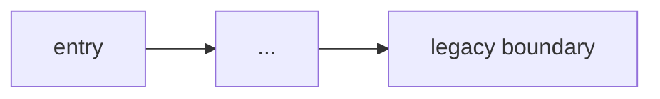

# Explain legacy

The read-only "understand before you touch" beat. Produces a blast-radius map a
senior engineer trusts, without editing anything.

## When to use

- New to a service, or before modifying a validated/legacy module.
- When asked to "explain this repo/service", "map the call graph", "what's the
  blast radius of changing X", or "diagram this".

## Steps (read-only)

1. Identify entry points and the module the user cares about.
2. Trace the call graph for the target behavior. Do not edit files.
3. Call out: god classes, missing tests on the touched path, external/legacy
   boundaries, and where state transitions happen.
4. Render a mermaid diagram of the flow.

## Output format

```
### What this service does
<2-3 sentences>

### Flow for <behavior>


### Blast radius of changing <target>
- Directly affected: <files/functions>
- Indirectly affected: <callers, tests, external systems>
- Untested paths touched: <list>

### Risks to watch
- <hidden coupling, legacy boundary, validated transitions>
```

## Rules

- Read-only. Never modify files in this skill.
- Prefer citing real files/functions over generic description.
- Keep the diagram small enough to read on a shared screen.
